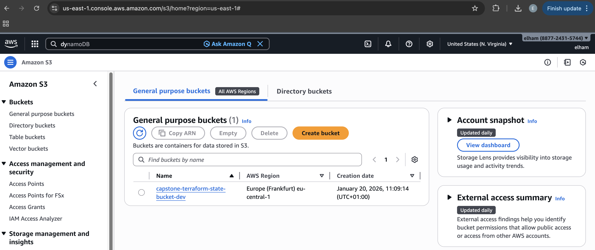

# 🧠 Project Overview: Amazon Product Review Analytics (Capstone Project)

---

## 🎯 Goal of the Project

To build a scalable, modular, and cloud-native data pipeline for ingesting, processing, transforming, and analyzing Amazon product reviews using modern data engineering tools on AWS.

---

## 📊 What This Project Does

- Ingests Amazon review data from S3
- Catalogs and parses data using AWS Glue
- Orchestrates data movement using Step Functions
- Loads and models data in Snowflake using DBT
- Schedules and monitors workflows via Airflow
- Visualizes insights using Amazon QuickSight

---

## 🧱 High-Level Architecture

---

## 🛠 Tech Stack & Tools

| Layer                 | Tools & Services Used                     |
|-----------------------|-------------------------------------------|
| Infrastructure        | Terraform, GitHub Actions                 |
| Data Ingestion        | AWS S3, AWS Glue, AWS Lambda              |
| Orchestration         | AWS Step Functions, Apache Airflow        |
| Data Warehouse        | Snowflake                                 |
| Transformation        | DBT (Data Build Tool)                     |
| Visualization         | Amazon QuickSight                         |
| CI/CD                 | GitHub Actions                            |
| Programming Language  | Python                                    |

---

## 🔁 Project Phases Overview

| Phase | Description                                          |
|-------|------------------------------------------------------|
| 01    | Terraform Bootstrap (S3 state + DynamoDB lock)       |
| 02    | Terraform Infra Setup (all modules)                  |
| 03    | GitHub Actions CI/CD Integration                     |
| 04    | S3 Data Ingestion Bucket                             |
| 05    | AWS Glue Crawler & Table                             |
| 06    | Step Function Orchestration                          |
| 07    | Snowflake Setup (DB, Schema, Stage, Table)           |
| 08    | Snowflake Integration with S3                        |
| 09    | DBT + Airflow Modeling & Scheduling                  |
| 10    | QuickSight Dashboard Creation                        |
| 11    | Final Testing, Validation and Documentation          |
| 99    | Final Architecture & Learnings                       |

---

## ✅ Current Progress

- [x] Phase 01: Bootstrap completed (S3 + DynamoDB)
- [ ] Phase 02: Infra modules in progress
- [ ] Phase 03+: To be developed step-by-step

---

## 🧠 Key Concepts Covered So Far

- Remote backend management with S3
- State locking with DynamoDB
- Terraform Workspaces and Environments
- Hands-on with AWS CLI and IAM setup
- Documenting everything in structured markdown files

---

## 📸 Key Screenshots

- ✅ IAM User & AWS CLI Config:  
  

- ✅ State locking with DynamoDB:
  

  
- ✅ Remote backend management with S3:
  

- ✅ Terraform Apply Bootstrap:  
  

---

## 📝 Next Steps

➡️ Move on to [01 - Bootstrap Documentation](./01-bootstrap.md)  
➡️ Begin defining infrastructure modules for each AWS component