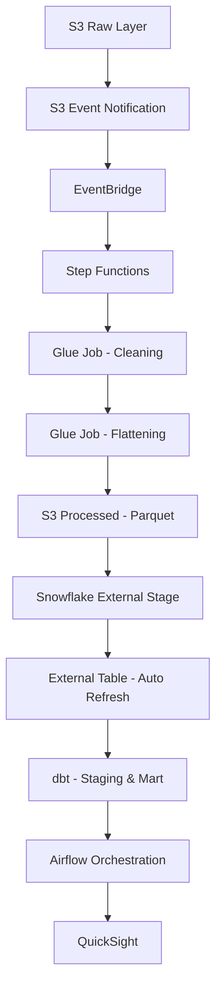

# 01 — Architecture Design Document

## 1. Purpose

This document describes the architecture of the Amazon Review Analytics platform, including design decisions, component responsibilities, event flow, and scalability considerations.

The system is designed as a secure, event-driven, cloud-native data platform following Infrastructure as Code (IaC) and production-grade design principles.

---

## 2. High-Level Architecture

### End-to-End Data Flow

The architecture is fully automated from ingestion to analytics.

---

## 3. Architectural Principles

The system is built on the following principles:

- Event-driven processing
- Infrastructure as Code
- Least-privilege security model
- Modular infrastructure design
- Separation of storage and compute
- Layered data modeling

---

## 4. Component-Level Design

### 4.1 Amazon S3 (Raw Layer)

Purpose:
- Landing zone for incoming JSON review files

Design Decision:
- S3 chosen for scalability and durability
- Raw data remains immutable
- Serves as the trigger point for pipeline execution

---

### 4.2 EventBridge

Purpose:
- Captures S3 object creation events
- Routes events to Step Functions

Design Decision:
- Decouples storage from processing
- Enables flexible event filtering
- Supports future expansion (e.g., multiple event consumers)

---

### 4.3 AWS Step Functions

Purpose:
- Orchestrates Glue jobs
- Manages workflow state

Design Decision:
- Chosen over Lambda chaining for better visibility and failure handling
- Enables structured workflow (clean → flatten)
- Supports retries and error handling

Benefits:
- Centralized orchestration
- Observability via execution history
- Controlled sequencing

---

### 4.4 AWS Glue Jobs

Two separate jobs are implemented:

#### Glue Job 1 — Cleaning

Responsibilities:
- Data validation
- Type normalization
- Removal of corrupt records

#### Glue Job 2 — Flattening

Responsibilities:
- JSON structure flattening
- Schema normalization
- Conversion to Parquet format

Design Decision (Two Jobs Instead of One):

- Separation of concerns
- Easier debugging
- Reusability
- Independent scaling

This follows production ETL modularity principles.

---

### 4.5 S3 (Processed Layer)

Purpose:
- Stores cleaned and flattened Parquet files

Design Decision:
- Parquet for columnar efficiency
- Optimized for Snowflake external querying
- Acts as data lake processed zone

---

### 4.6 Snowflake (External Table Architecture)

Snowflake is configured with:

- Storage Integration (IAM-based)
- External Stage
- External Table
- Auto-refresh enabled via S3 event notifications

Design Decision:

- External Tables instead of COPY INTO
- Data remains in S3
- Snowflake maintains only metadata

When new files arrive:
- Metadata refresh is triggered automatically
- External table reflects new files
- No physical data ingestion occurs

Benefits:
- Reduced storage cost
- Clear data lake separation
- Simplified ingestion flow

---

### 4.7 dbt (Transformation Layer)

Two-layer modeling approach:

- Staging Layer → Source-aligned transformations
- Mart Layer → Business-ready aggregated models

Design Decision:
- Clear grain definition per model
- Business logic isolated in mart layer
- Test-driven modeling (not_null, unique, relationships)

---

### 4.8 Apache Airflow

Current State:
- DAG runs on schedule interval

Responsibilities:
- Orchestrates dbt execution
- Controls downstream analytics tasks

Future Enhancement:
- Event-driven DAG triggering via EventBridge

Design Decision:
- Separation between data ingestion (Step Functions) and analytics orchestration (Airflow)
- Enables future extensibility

---

## 5. End-to-End Event Sequence

1. A new file is uploaded to S3 (raw).
2. S3 emits an object creation event.
3. EventBridge captures the event.
4. EventBridge triggers Step Functions.
5. Step Functions runs:
- Glue Cleaning Job
- Glue Flattening Job
6. Processed Parquet files are written to S3 (processed).
7. S3 event triggers Snowflake metadata refresh.
8. External table updates automatically.
9. dbt transforms data into staging and mart layers.
10. Airflow orchestrates scheduled analytics workflows.
11. QuickSight consumes mart datasets.

The pipeline is fully automated.

---

## 6. Security Architecture

- OIDC-based GitHub authentication
- No hard-coded AWS credentials
- Least-privilege IAM roles
- Terraform remote state stored in S3
- DynamoDB locking enabled
- Snowflake IAM-based storage integration

All infrastructure is provisioned via Terraform.

---

## 7. Scalability Considerations

- S3 scales automatically
- Glue jobs can scale with worker configuration
- Step Functions handles concurrent executions
- Snowflake separates compute and storage
- dbt transformations are modular and incremental-ready

The architecture supports horizontal scaling and future enhancements.

---

## 8. Failure Handling Strategy

- Step Functions supports retries and failure states
- Glue job logs available in CloudWatch
- Event-driven decoupling prevents cascading failures
- Airflow provides retry mechanisms

This design ensures operational resilience.

---

## 9. Why This Is Production-Ready

- Fully automated
- Event-driven ingestion
- Secure CI/CD
- IaC-managed infrastructure
- Clear separation of concerns
- Modular and extensible

This architecture reflects modern cloud data engineering best practices.
