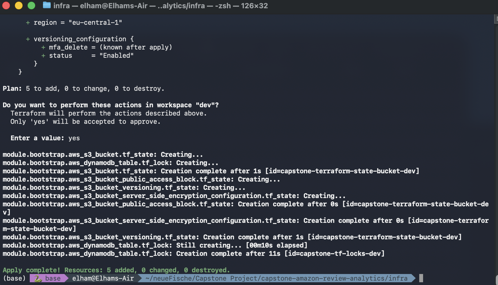

# 📦 Phase 01: Terraform Bootstrap (S3 State + DynamoDB Lock)

---

## 🎯 Goal of This Phase

To initialize the infrastructure needed for Terraform itself to operate safely and collaboratively, by creating:
- A remote S3 bucket to store the `terraform.tfstate` file
- A DynamoDB table for state locking (to avoid concurrent modifications)
- Basic configurations like encryption and versioning

---

## 📦 Resources Created

| Resource              | Purpose                                          |
|-----------------------|--------------------------------------------------|
| S3 Bucket             | Stores Terraform state remotely                 |
| DynamoDB Table        | Enables state locking for concurrency safety    |
| Public Access Block   | Blocks all public access to the state bucket    |
| Versioning            | Enables version control of `tfstate` file       |
| SSE Encryption        | Enables AES256 encryption for S3 objects        |

---

## 🛠 Tools Used

- **Terraform**
- **AWS S3**
- **AWS DynamoDB**
- **Terraform CLI Workspaces**
- **AWS CLI**

---

## 📁 File & Module Structure

```
infra/
├── main.tf
├── provider.tf
├── variables.tf
├── backend.tf
└── modules/
    └── bootstrap/
        ├── main.tf
        ├── variables.tf
        └── outputs.tf
```

---

## 🔑 Key Variables

```hcl
variable "bucket_name" {
  description = "Base name of S3 bucket"
  type        = string
}

variable "lock_table_name" {
  description = "Name of DynamoDB table used for state locking"
  type        = string
}

variable "environment" {
  description = "Deployment environment (e.g., dev, prod)"
  type        = string
}

variable "enable_versioning" {
  description = "Enable versioning for S3 bucket"
  type        = bool
  default     = true
}
```

---

## 💻 Execution Steps

```bash
# Disable backend temporarily
mv backend.tf backend.tf.disabled

# Initialize Terraform locally
terraform init

# Create dev workspace
terraform workspace new dev

# Apply the bootstrap module
terraform apply 

# Re-enable backend and re-init
mv backend.tf.disabled backend.tf
terraform init
```

---

## ✅ Output Screenshot



---

## ⚠️ Common Issues & Fixes

| Error Message                          | Cause                                  | Solution                                 |
|----------------------------------------|----------------------------------------|-------------------------------------------|
| Duplicate `backend` block              | Multiple backend files active          | Rename or remove extra backend.tf files   |
| S3 bucket not found during `init`      | Bucket not created yet                 | Disable backend temporarily during init   |
| Missing variable `environment`         | Not passed to module                   | Add `environment = "dev"` to main.tf      |

---

## 📌 Key Learnings

- Always separate bootstrap phase from main infrastructure
- Remote backend should not be active before S3/DynamoDB exist
- Use workspaces + variables to separate dev/prod environments

---

## ⏭ Next Phase

➡️ Proceed to [02 - Terraform Infra Setup](./02-terraform-infra.md)